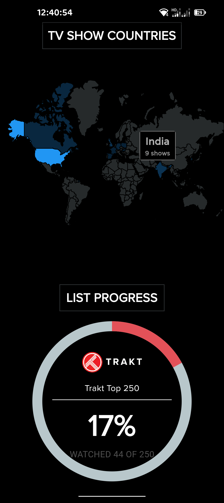

# Trakt All Time Stats
This app shows trakt [all-time-stats](https://blog.trakt.tv/all-time-year-in-review-f6f931e4461d) like the official version without the need of trakt vip subscription.

# Usage
Generate `all-time-stats.json` file using this [program](https://github.com/Ahmedazim7804/trakt_vip_stats).
 
Then select that file in the app. 
Or you can use the hosted [app](https://traktstats.netlify.app/) (NOTE:- not yet optimized for web).

# Screenshots

  
  
  

  
  

# Permissions
- No permissions are requested.
- App only require Internet permission to fetch images needed from internet at runtime.
